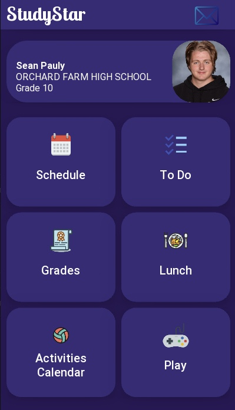
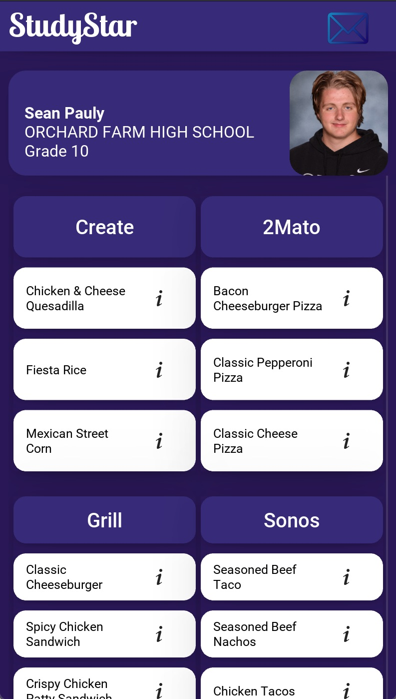

<h1 align="center">STUDYSTAR VERSION: 0.0.1</h1>
<h4 align="center">Authors: Sean Pauly & Harrison Reineke</h4>
<h4 align="center">Voice: 314-341-2694</h4>
<h4 align="center">Email: thatonecoder06@gmail.com</h4>

  
  
  
  
  
  

<h2 align="center">General Usage Notes</h2>

- STUDENTS WILL HAVE THESE SCREENS

  ( EX: HOME, PROFILE, GRADES, SCHEDULE, ACTIVITIES CALENDAR, PLAY, LUNCH, TODO )

- FUTURE UPDATES WILL INCLUDE AN ADMINSTRATION VERSION

- STUDENTS USERNAME IS THEIR FIRST MIDDLE AND LAST INITIAL CAPITILIZED

 ( EX: JOHN ADAMS SMITH'S USERNAME WOULD BE "JAS" )

- STUDENTS PASSWORD IS THEIR BIRTHDAY

 ( EX: IF JOHN ADAMS SMITH'S BIRTHDAY IS JANUARY 23, 2006, THEN HIS PASSWORD WOULD BE "012306" )

<h2 align="center">Built Using</h2>

VISUAL STUDIO CODE

PYTHON

KIVY

KIVYMD

HTML

CSS

JAVASCRIPT

NODE

<h2 align="center">Software Requirements</h2>

<ins><u>Python Version 3.9</u></ins>

  <a href="https://www.python.org/downloads/#:~:text=Nov.%2015%2C%202021-,Download,-Release%20Notes">Download</a>

<ins><u>Node.js</u></ins>

  <a href="https://nodejs.org/en/download/">Download</a>

<ins><u>Latest Version - Visual Studio Code</u></ins>

  <a href="https://code.visualstudio.com/download">Download</a>

<ins><u>Latest Version - Kivy Module</u></ins>

  <a href="https://kivy.org/doc/stable/gettingstarted/installation.html">Download</a>

<ins><u>Latest Version - KivyMD Module</u></ins>

  <a href="https://kivymd.readthedocs.io/en/latest/getting-started/">Download</a>

<h2 align="center">Installation Instructions</h2>
<h2 align="center">Viewing Instructions</h2>
<h2 align="center">Mobile App Login Instructions</h2>

THE FOLLOWING ACCOUNTS HAVE BEEN MADE FOR TESTING PURPOSES FOR THE JUDGES OF FBLA

<h5 align="center">STUDENT CREDENTIALS</h5>
<h6 align="center">USERNAME: SMP (Sean Michael Pauly) | PASSWORD: 021006 (Sean's Birthday)</h6>
<h6 align="center">USERNAME: HWR (Harrison Wyatt Reineke) | PASSWORD: 070506 (Harry's Birthday)</h6>
